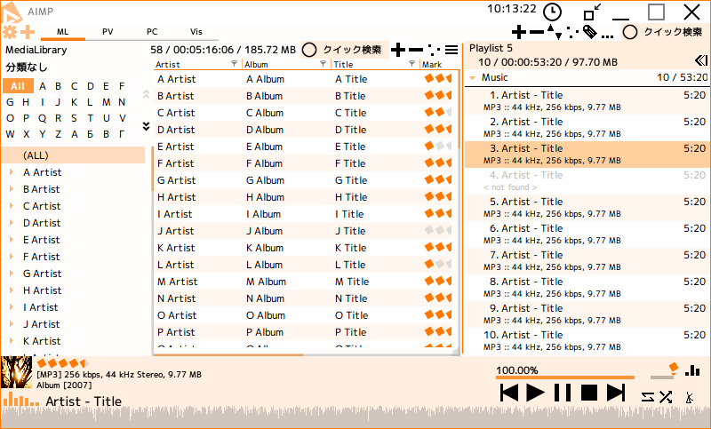

# skin-MusicExplorer

Windowsのファイラから着想を得たAIMP用スキン  
その昔に自分用に制作し、公開していたもの  

残っていたデータを基にリポジトリとして構築したものであるため、情報が抜け落ちている部分があります  
ご了承ください  

## 動作環境

- AIMP for Windows v4.00、またはそれ以降

AIMP公式サイトから最新のバージョンをダウンロードできます: [http://www.aimp.ru/](http://www.aimp.ru/?do=download&os=windows)

## スクリーンショット

## 開発環境

- AIMP SkinEditor v4.00 build 887  

AIMP公式サイトからダウンロードできます: [http://www.aimp.ru/](http://www.aimp.ru/?do=download&os=windows&cat=se)

## リリースノート

- 2017.06.17 v1.12 Update
    再公開に向けライセンスおよび一部の情報を修正
- 2016.09.25 v1.12
    プレイコントロールのレイアウト修正
    v1.10よりビジュアライザの一部が表示されない問題を修正
- 2016.09.01 v1.10
    コンパクトモード・プレイコントロールの追加
- 2016.08.28 v1.02
    細かな修正を加え、正式配布開始
