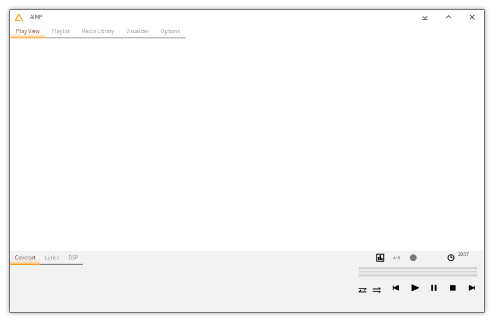

# skin-MusicExplorer

Windowsのファイラから着想を得たAIMP用スキン  
その昔に自分用に制作し、公開していたもの  

## 動作環境

- < v2.00  
  AIMP for Windows v4.00、またはそれ以降  
- v2.00-  
  AIMP for Windows v4.60、またはそれ以降  

AIMP公式サイトから最新のバージョンをダウンロードできます: [http://www.aimp.ru/](http://www.aimp.ru/?do=download&os=windows)

## スクリーンショット

- v1.12  
    
- v2.00 alpha 100  
    

## 開発環境

- < v2.00  
  AIMP SkinEditor v4.00 build 887  
- 2.00 -  
  AIMP SkinEditor v4.60 build 1085  

AIMP公式サイトからダウンロードできます: [http://www.aimp.ru/](http://www.aimp.ru/?do=download&os=windows&cat=se)

## フォント埋め込みについて

MusicExplorer v1はスキンファイル内部にフォントを埋め込んでいます。  
(MusicExplorer v2はフォントの埋め込みは現在行っていません。)  

- [MigMix 2P](https://mix-mplus-ipa.osdn.jp/migmix/)

フォントの制作に携わった方々に感謝いたします。

## リリースノート

- 2020.07.12 v2.00 alpha 100  
    テクスチャの調整  
    ダークテーマの実装、ナイトモード対応  
    メインフォーム: プレイヤーコントロールの曲タイトルクリック時の挙動の実装  
    メインフォーム: プレイビューの拡張  
    メインフォーム: 設定画面の実装  
    ライブラリフォーム: バックグラウンドタスクの表示を実装  
    その他イースターエッグの実装  
- 2020.06.30 v2.00 alpha 50  
    プロジェクト再始動、すべてのリソースを0から作成
- 2017.06.17 v1.12 Update  
    再公開に向けライセンスおよび一部の情報を修正  
- 2016.09.25 v1.12  
    プレイコントロールのレイアウト修正  
    v1.10よりビジュアライザの一部が表示されない問題を修正  
- 2016.09.01 v1.10  
    コンパクトモード・プレイコントロールの追加  
- 2016.08.28 v1.02  
    細かな修正を加え、正式配布開始  
